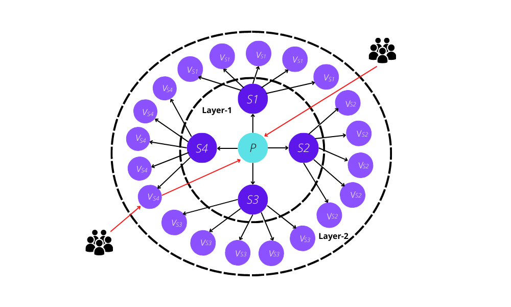

# 1.2 Cluster Architecture

In the HBTF cluster, all transactions sent by the clients will be passed to the Prime node. The Prime node will then distribute the transactions among the supervisor nodes, and they pass the transactions to the verifiers. Fig. 1. illustrates the layers of HBFT with 5 validators in every squad.&#x20;

In a network with $$m$$ number of $$S$$ nodes and $$n$$ number of $$V$$ nodes, the consensus algorithm accommodates at $$[n/3]*[m/2]$$ faulty nodes to ensure the absolute safety of the system under malicious attacks. Meanwhile, only $$m^{2}+mn^{2}$$ inter-node messages, instead of $$O(Z^{2})$$ messages in a traditional single-layer PBFT network consensus, are required.
