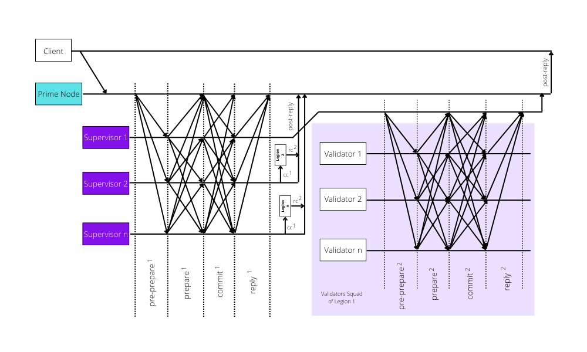

# 1.3 Consensus Flow

A client $$c$$ sends a request message $$[o,t,c]_{request}$$ to $$P$$.  This request invokes an operation $$o$$ with timestamp $$t$$. Timestamps are ordered by time, so the stamp of later operation contains higher values. The request is sent to the Supervisor nodes. The identity of the $$S$$ is extracted from the view number contained in replies from previous operations. On receiving the request, the Prime node multicasts messages using the protocol stated below.

As illustrated in Fig. 2., the Prime nodes reply results to the client directly. The $$post-reply$$ has the form $$[o,t,c,i,r,rc^1,v,GP]_{post-reply}$$ where $$v$$ is the current view number, $$i$$ is the replica number, $$r$$ is the result of the execution, $$rc$$ is the reply certificate, and $$GP$$ describes the replicas allocation.

Assuming there are a number of $$m$$ Supervisor nodes in the first layer and $$n$$  verifiers in the second, and the number of faulty replicas in a consensus group is $$f^g$$. If Prime node has received $$f^g+1$$ matching valid replies from the same consensus group (Legion), this group is said to have reached consensus. The network reaches a consensus when more than half of the groups have the same replies. The client only accepts results replied from group leaders when at least half of them are consistent.

### 1.3.1 First Layer Protocol

If the first layer, the Prime and $$m$$ Supervisor nodes form a consensus group. When the Prime node $$p$$ receives a request $$M=[o,t,c]_{request}$$ from client, it authenticates the request and client's identity. Then $$p$$ assigns a sequence number $$α$$ to $$M$$. After that, $$p$$ steps in $$pre −prepare$$ phase by multicasting $$[M, d, α, ν ]_{pre−prepare^1}$$ where $$d$$ is the digest of $$M$$. Super-script is to distinguish $$pre −prepare^1$$ in the first layer for $$pre −prepare^2$$ in the second layer. Primary multicasts message only among $$S$$ nodes. Thus, only Supervisor nodes react on $$pre −prepare^1$$. The operation is restricted since the protocol runs layer by layer. for $$pre-prepare, prepare,$$ and $$commit$$ messages, a Supervisor node accepts the one with the same view $$v$$; the authenticity is then verified. $$α$$ is between watermark $$h$$ and $$H.$$

With conditions above, a given $$S$$ node $$i$$ in the first layer accepts a $$pre-prepare^1$$ message from $$p$$ when there is none different request with the same view $$v$$ and sequence number $$α$$ is accepted. Then it multicasts $$[d, α, i, ν]_{prepare^1}$$message to all $$S^1_i$$in the first later. It records both $$_{pre-prepare^1}$$ and $$_{prepare^1}$$messages to its log.


**Algo. 1. Prime Node Normal-case Pseudocode**

**–––––––––––––––––––––––––––––––––––––––––––––**

**while** valid $$request^1$$ received=True **do**

&#x20;   **if** client identity authenticated=True **then**

&#x20;      $$m←n$$.

&#x20;      multicasts $${pre-prepare^2}$$ to $$S^1_i$$.

&#x20;   **end if**

**end while**

**while** valid prepare1received=True **do**

&#x20;   **if** number of valid $$prepare^1>2f$$ **then**&#x20;

&#x20;      forms $$prepared-certificate^1.$$

&#x20;      multicasts $$commit^1$$ to $$S^1_i$$.

&#x20;   **end if**&#x20;

**end while**

**while** valid $$commit^1$$ received=True **do**

&#x20;   **if** number of valid $$commit^1>2f$$ **then**&#x20;

&#x20;      forms $$commit-certificate^1.$$

&#x20;   **end if**

**end while**

**while** valid $$reply^1$$ received=True **do**

&#x20;   **if** number of valid $$reply^1$$>half of members **then**

&#x20;       forms $$rc^1$$.

&#x20;       reply client with $$post−reply^1$$.

&#x20;   **end if**

**end while**


During $$prepare$$ phase, each node in connection with $$S^1_i$$ collects $$2f$$ messages with matching sequence number $$α$$, view $$v$$, and request $$M$$. With the received $$_{pre-prepare^1}$$message, they form $$_{prepared-certicifate^1}$$ which indicated a particular $$S^1_i$$ Verfier $$V$$(e.g., $$V^{S^1_i}_5$$) has prepared the request. For prepared $$S^1_i$$, it multicasts $$[d, α, i, ν]_{commit^1}$$ and waits for more $$2f+1$$ matching $$_{commit^1}$$ messages with same view, sequence, and digits from different $$V^{S^1_i}_i$$ verifiers. Received message from $$_{commit-certificate^1}$$ ($$cc^1$$) and this request is said to be committed on $$S^1_i$$. Then the Supervisor node pauses the execution and initiates another round of the protocol in the second layer as described in Section 1.3.2.&#x20;

The committed Supervisors send $$[o, t, i, r, ν]_{reply^1}$$ to the $$p$$. The Prime node confirms that this cluster group has reached a consensus by checking more than half of the Supervisors reply consistent $$_{reply^1}$$message, including itself. The Prime node $$p$$ collects $$_{reply^1}$$ and forms a reply-certiciate $$rc^1$$. It's important to note that it is not necessary for $$p$$ to reply to the client on behalf on consensus, but we require $$p$$ to do so to keep the algorithm the same on all nodes in case of massive deployment.&#x20;

### 1.3.2 Second Layer Protocol

A committed $$S$$ multicasts new $$pre-prepare$$ message to $$V^{S_i}_i$$ within the same Legion $$L$$ where another round of PBFT is implemented. All nodes reply to the Supervisor in the same manner described in Section 1.3.1 when the request is committed agagin. For a replica $$r^{1}_s$$ which acts as the Supervisor $$S$$ node, it multicasts a similar $$[M, d, α, ν, cc^1]_{pre-prepare^2}$$ to $$V^{S_i}_i$$replicas in same Legion where $$cc^1$$is the $$_{commit-certificate^1}$$. The $$v$$, $$α$$, and $$M$$are inherited from the previous process. A $$V^{S_i}_i$$ verifier will accept the request if the condition mentioned in the first layer protocol is satisfied, in addition to the presence of $$cc^1$$. In Covenant consensus, the conditions are implemented by $$S$$ using the _Intium Constitution Craft_.


**Algo 2.** $$S^1_i$$ **Node Normal-case Pseudocode**

**––––––––––––––––––––––––––––––––––––––––––**

**while** valid pre −prepare1received=True do

&#x20;         multicasts $$prepare^1$$ to $$p$$.

**end while**

**while** valid $$prepare^1$$ received=True **do**

&#x20;   **if** number of valid $$prepare^1>2f$$ **then**

&#x20;      forms $$prepared−certificate^1$$.

&#x20;      multicasts $$commit^1$$ to $$S^1_i$$.

&#x20;   **end if**

**end while**

**while** valid $$commit^1$$ received=True **do**

&#x20;    **if** number of valid $$commit^1>2f$$ **then**

&#x20;       forms $$commit−certificate^1$$.

&#x20;       multicasts $$pre-prepare^2$$ to subordinate $$V^{S_i}_i$$.

&#x20;   **end if**

**end while**

**while** valid $$prepare^2$$ received=True **do**

&#x20;   **if** number of valid $$prepare^2>2f$$ **then**&#x20;

&#x20;      forms $$prepared−certificate^2$$.

&#x20;      multicasts $$commit^2$$ to $$V^{S_i}_i$$.

&#x20;   **end if**

**end while**

**while** valid $$commit^2$$ received=True **do**

&#x20;   **if** number of valid $$commit^2>2f$$ **then**

&#x20;      forms $$commit-certificate^2$$.

&#x20;      reply $$p$$ with $$reply^1$$.

&#x20;   **end if**

**end while**

while valid $$reply^2$$ received=True **do**&#x20;

&#x20;   **if** number of valid $$reply^2$$>half of members **then**&#x20;

&#x20;      forms $$rc^2$$.

&#x20;      reply client with $$post-reply^2$$.

&#x20;   **end if**

**end while**


On receiving valid $$_{pre-prepare^2}$$message, the $$_{pre-prepared}$$$$V^{S_i}_i$$multicasts $$[d, α, i, ν]_{prepare^2}$$ message to all $$V^{S_i}_i$$ nodes in same Squad. It adds both $$_{pre-prepare^2}$$and $$_{prepare^2}$$message to its log. In the $$_{prepare^2}$$phase, each $$V^{S_i}_i$$ each validator collects $$2f$$messages with matching sequence number $$α$$, view $$v$$, and request $$M.$$ With received $$_{pre-prepare^2}$$ message, it forms a quorum prepared $$_{certificate^2}$$, which indates that this $$V^{S_i}_i$$ validator has prepared the request.&#x20;


**Algo. 3.** $$V^{S_i}_i$$ **Normal-case Pseudocod**

**–––––––––––––––––––––––––––––––––––––**

**while** valid $$pre−prepare^2$$ received=True **do**

&#x20;         multicasts $$prepare^2$$ to $$S^1_i$$ $$V^{S_i}_i$$in same legion.

**end while**

**while** valid $$prepare^2$$ received=True **do**

&#x20;   if number of valid $$prepare^2>2f$$ **then**&#x20;

&#x20;      forms $$prepared−certificate^2$$.

&#x20;      multicasts $$commit^2$$ to $$V^{S_i}_i$$ in same legion.

&#x20;   **end if**

**end while**

**while** valid $$commit^2$$ received=True **do**

&#x20;   if number of valid $$commit^2>2f$$ then&#x20;

&#x20;      Forms a quorum $$commit−certificate^2$$.

&#x20;      Send $$reply^2$$ to $$S^1_i$$.

&#x20;   **end if**

**end** **while**


Then the prepared $$V^{S_i}_i$$ validators and their $$S$$ multicast $$[d, α, i, ν]_{commit^2}$$ and collect $$2f+1$$ matching $$_{commit^2}$$messages with the same view, sequence, and digest from the different $$V^{S_i}_i$$ nodes.

These $$_{commit^2}$$ form $$_{commit-certificate^2}$$, and this request is said to be committed. Varifier then executes the massage which has been committed. After the execution, all group members reply to their $$S$$, and the $$S$$ replies to the $$p$$ and it replies to the client in a similar manner described before.

