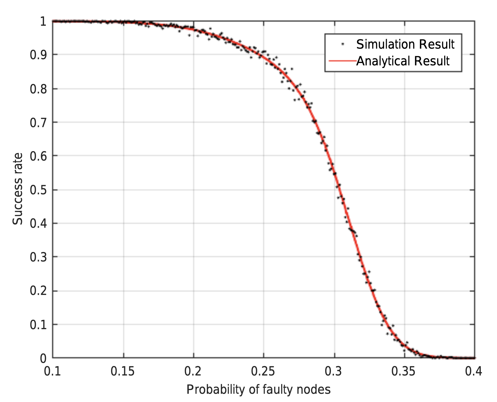
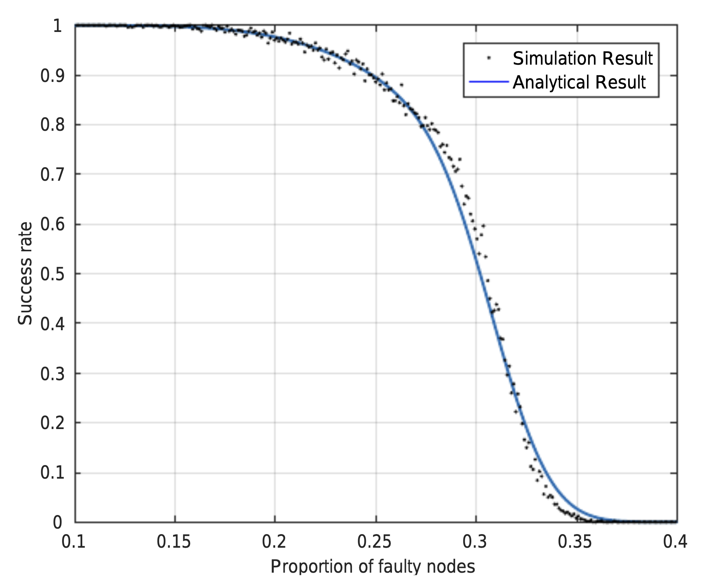

# 1.6 Safety and Liveness

Since the protocol requires more than ⅔ replicas to communities before advancing into the next operation (to ensure the number of responses from non-faulty replicas is always greater than that from faulty), there is at least one non-faulty replica overlap for two consecutive operations. All non-faulty replicas agree on each other, then they agree on the total order of operations, providing safety. Also, the bound of faulty replicas indicates the protocol always collects sufficient responses to proceed for liveness. The consensus in the upper layer is the precondition to invoke protocol in sub-groups. Thus, safety is guaranteed across groups. The modifiedview change protocol replaces faulty group leader. Thus, liveness is guaranteed across groups.&#x20;

In the HBFT, nodes in both layers participate in the consensus-reaching process. The first layer is a classic PBFT model that tolerates no more than $$[m/3]$$ faulty nodes based on the conclusion $$Z ≥ 3f+ 1$$ \[11]. In the second layer, as there are $$m$$ HBFT consensus groups, we need to analyze the threshold of consensus-reached sub-groups required to ensure the security and Liveness of the whole system. During the consensus-reaching process, as the leader of each sub-group (Supervisor of the Legion) directly sends $$post−reply$$ to the Prime node, each consensus sub-group is regarded as a whole. While any individual node in PBFT systems can be divided into three categories, including consensus reached, not-reached and faulty node. A consensus network may only be in two situations: consensus reached and not reached. In other words, a consensus sub-group would also be in two situations, either consensus reached or not. In this case, a system tolerates at most $$[m/2]$$ failed groups to reach consensus, i.e., the security threshold of consensus-reached sub-groups is$$[m/2]$$.

To facilitate distributed systems and blockchain in different environments, we analyze the success rate in two models under malicious attacks. The faulty probability determined (FPD) model is used when the probability of every single faulty node is fixed, and the faulty number determined (FND) model is used when the number of faulty nodes in the system is fixed. In these two models, we are given different initial conditions to analyze the security performance of the system. More specifically, we assume the faulty nodes in the FPD model are independent of each other, and they have the same faulty probability. Conversely, in the FND model, the probability of whether one node is faulty depends on other nodes because the total number of faulty nodes is fixed. In addition, these two models have different application scenarios. The FND model, which is more similar to the traditional PBFT, is suitable for small systems where the number of faulty nodes can be easily estimated. However, it is more appropriate to use FPDmodel to evaluate the performance of large systems where node failure is estimated by probability. The table below shows the frequently used notions that will be used in this section.&#x20;

|             |                                                                |
| ----------- | -------------------------------------------------------------- |
|  $$P_p$$    | consensus success rate in FPD model                            |
|  $$P_f$$    | faulty probability of nodes                                    |
|  $$P(A)$$   | probability of Event A                                         |
| $$P(B|A)$$  | probability of Event B under the condition of EventA happening |
|  $$P_N$$    | consensus success rate in FND model                            |
|  $$K$$      | total number of faulty nodes                                   |
| $$P_A$$     | consensus success rate in advanced model                       |
|  $$Z_X$$    | total number of nodes in X-layer system                        |
|  $$C_X$$    | communication complexity of X-layer system                     |
|  $$T_X$$    | threshold to guarantee success in X-layer system               |

We will consider two scenarios  (1) faulty probability determined and (2) faulty number determined to conduct a security threshold analysis.&#x20;

### 1) Faulty Probability Determined (FPD Model)

Let’s assume $$P_f$$ is the faulty probability of each node. To findout the relationship between the success rate $$P_p$$ and $$P_f$$, we shallfirst define two important conditions under which consensus can be reached.

We consider two events as below:

* Event A: no more than $$[m/3]$$ faulty nodes in the first layer&#x20;
* Event B: no more than $$[m/2]$$ Legions fail in the second layer&#x20;

In addition, Event A and Event B are not independent. If one node in the first layer is faulty, it will be impossible for the corresponding Legions to reach consensus. Therefore, we have $$PP=P(A)×P(B|A)$$. Assume that there are $$i$$ faulty nodes in the first layer and $$0≤i≤[m/3]$$. According to the cumulative distribution function \[12], we can get&#x20;

$$
P(A)=∑^{[m/3]}_{i=0}(1-P_f)^{m-i}P^i_F.
$$

The value of $$P(B|A)$$ depends on the value of $$P(A)$$. The above equation indicates there are already $$i$$ faulty nodes in the first layer. It means $$i$$ out of $$m$$ groups in the second layer share no chanceto reach consensus as they have a faulty Supervisor node. Therefore, there can be at most $$[m/2]$$ failed groups in the second layer. We assume there are $$j$$ groups, which do not have a faulty Supervisor, fail to reach consensus means $$0≤j≤[m/2]−i$$. We have

$$
P(B|A)=∑^{[m/3]-i}_{j=0}P^i_g(1-P_g)^{(m-i-j)}
$$

$$P_g$$ represents the probability of a group, with a non-faulty leader, failing to reach a consensus. We assume there are $$g$$ faulty nodes in one single group. To make this group fail, $$[n/3]+1≤g≤n$$ since HBFT group tolerates up to bn3cfaulty nodes. Therefore, we have

$$
P_g=∑^{n}_{g=[n/3]+1} C^g_fP^g_f(1-P_f)^{n-g}
$$

We can get the function of the system consensus success rate $$P_p$$ against $$P_f$$ as follows

$$
P_p=∑^{[m/3]}_{i=0} (C^i_m(1-P_f)^{(m-1)}P^i_f∑^{[m/2]}_{i=0}P^j_g(1-P_g)^{(m-i-j)})
$$

The result of the simulation and matching of the analytical results of the FPD model in $$m=n=30$$ is illustrated in the figure below.&#x20;

### 2) Faulty Number Determined (FND Model)

In the FND model, we assume that there are $$K$$ faulty nodes in the whole system and aim to find the relationship between $$K$$ and the success rate $$P_N$$. Meanwhile, we can use the same assumption of event A and event B to calculate $$P_N$$, where $$P_N=P(A)×P(B|A).$$

Unlike the FPD model, P(A)and P(B|A) are calculated using the hypergeometric model \[13] since the FND model is based on the prerequisite of a fixed number of faulty nodes. Thus, we have

$$
P(A)=[1/C^K_{m+mn}]∑^{[m/3]}_{i=0}C^i_mC^{K-i}_{mn}
$$

Also, there should be at most $$[m/2]-i$$ failed Legions with non-faulty Supervisors, which means at most them have more than $$[n/3]$$ faulty nodes. However, in the FND model, the number of faulty nodes in each group affects situations in the other groups so it will be extremely complicated to consider $$m$$ groups together. Therefore, a simplified binomial distribution model on the group level is adopted, assuming every group has the same faulty probability of $$P_{g2}$$. Therefore, we will have

$$
P(B|A)≈∑^{[m/3]-i}_{i=0}P^i_{g2}(1-P_{g2})^{(m-i-j)}
$$

$$P_{g2}$$ represents the probability of a group with a non-faulty leader failing in the second layer. It can be calculated as follows

$$
P_{g2}=∑^n_{g=[n/3]+1}(C^g_nC^{K-g}_{mn-n-1}/C^K_{m+mn-1})
$$

Then we can get the probability $$P_N$$ against $$K$$ as&#x20;

$$
P_N=(1/C^K_{m+mn})∑^{[m/3]}_{i=0}(C^i_mC^{K-i}_{mn}∑^{([m/2]-i)}_{j=0}P^i_{g2}(1-P_{g2})^{(m-i-j)})
$$

Fig. 4. illustrates the analytical and simulation curves for success rate in the FND model in $$m=n=30$$.&#x20;

