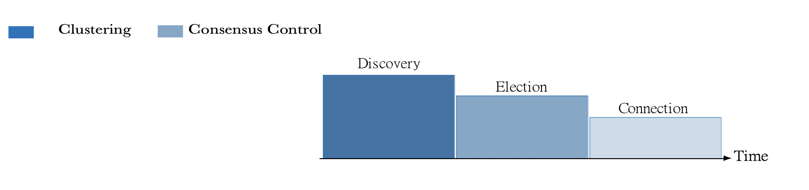

# 2.4 Clusterig Pahse

In the first phase of Covenant, the nodes are grouped into clusters. A clustering process is a state machine of 3 states: 1) neighbor discovery, 2) election, and 3) connection.

Nodes become aware of their neighboring nodes in the neighbor discovery state. Time information is added to the messages to achieve an implicit synchronization during this state, similar to Gradient Time Synchronization Protocol (GTSP). GTSP achieves time synchronization by averaging neighbor time information and provides resilience for the clustering phase (C-GTSP).&#x20;

During the election phase, a representative node, the Prime, is chosen as a cluster head (CH) based on the maximum degree (number of connections) of a node. Lastly, the connection state selects a representative bridge node (node that belongs to multiple clusters) as a cluster bridge (CB) and other bridge nodes as supervision cluster bridges (Supervisor nodes)  to ensure inter-cluster connectivity and resilience.

