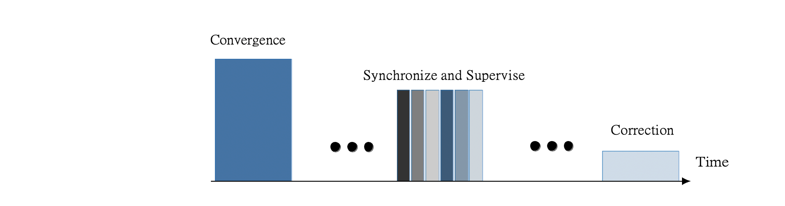

# 2.5 Consensus Control Phase

Consensus Control (Cons-Ctrl) is the second phase of Covenant which repeats periodically after specific time slots to maintain the synchronization. The cluster head exchanges time information to find _local centers_ of their neighborhood.&#x20;

The configuration limits the maximum number of hops before reaching the consensus. Local centers bound the maximum error across the network. The time information of the local centers is propagated back to the CHs in the reverse direction after the convergence. The order of the Prime Node receiving data is the reverse of finding local centers; hence, the time-division multiple access (_TDMA)_ slots for each cluster are created accordingly for the _synchronize and supervise_ phase. Thus, the protocol scales very well for more extensive network sizes without additional energy loss and additional delay for consensus. However, given the dynamic nature of the network, some nodes may fail, or new nodes may join the network. If there are significant changes (e.g., change in CH), clustering is triggered again to establish new clusters with the optional _correction_ state of the consensus phase in Figure 7.

The elected cluster bridge (CB) and supervision cluster bridge (SCB) nodes act as supervision nodes to monitor the broadcast data of Prime nodes to their cluster member nodes. SCB also ensures reliable and accurate information propagation during consensus. In the case of a byzantine fault, e.g., the Prime node sending corrupt time information, CBs and SCBs intervene and share the legitimate value of time. As Cluster Bridges are connected to other clusters, they further forward the valid time information along the network path. Hence, the impact of a byzantine event can be detected and contained within a single cluster.
