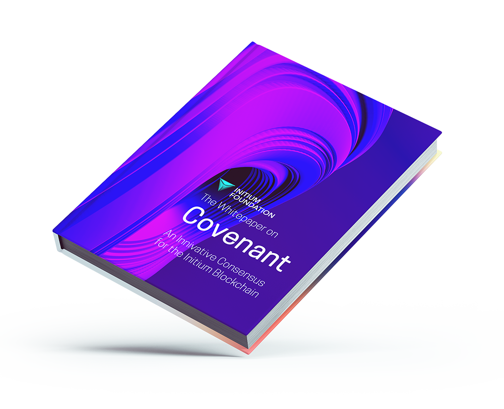

# Abstract

The Initium Foundation releases this whitepaper as a non-profit foundation for developing, maintaining, and promoting the Initium network.

This paper discusses the key implementation details, particularly the Covenant consensus mechanism, a hybrid multi-layer Practical Byzantine Fault Tolerance (PBFT) consensus mechanism that will be implemented in the Initium blockchain.&#x20;

PBFT consensus mechanism shows a great potential to break the performance bottleneck of the Proof-of-Work (PoW) based blockchain systems, which typically support only dozens of transactions per second and require minutes to hours for transaction confirmation. However, due to frequent inter-node communications, the PBFT mechanism has poor node scalability, and thus it is typically adopted in small networks. To enable PBFT in large systems such as massive Internet of Things (IoT) ecosystems and blockchain, in this paper, Covenant consensus, a scalable multi-layer PBFT-based consensus mechanism, is proposed by hierarchically grouping nodes into different layers and limiting the communication within the group. This paper first proposes an optimal multi-layer PBFT and significantly reduces the communication complexity. Specifically, it minimizes the communication complexity by evenly distributing the nodes within the sub-groups in the second layer. The security threshold is analyzed based on Faulty Probability Determined (FPD) and the Faulty Number Determined (FND) models.

This whitepaper is subject to [disclosure](disclosure.md).&#x20;
